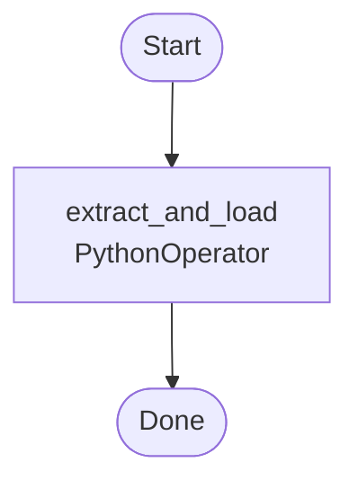

# COVID-19 Data Pipeline with Apache Airflow & PostgreSQL

This project demonstrates an end-to-end ETL (Extract, Transform, Load) workflow using **Apache Airflow** to automate the extraction of real-time COVID-19 data from a public API and load it into a **PostgreSQL** database for analysis and visualization.

## 🚀 Overview

The Airflow DAG (`covid_etl.py`) performs the following tasks:
1. **Extracts** live COVID-19 statistics for the United States from the [disease.sh API](https://disease.sh).
2. **Transforms** the response into a structured format.
3. **Loads** the results into a PostgreSQL table named `etl.covid_stats`.

The DAG runs on a scheduled interval (or manually) and stores timestamped records of cases, deaths, and recoveries for trend analysis.

---

## 🧩 Tech Stack

- **Apache Airflow** – Workflow orchestration  
- **Python** – Data extraction & transformation logic  
- **PostgreSQL** – Data storage  
- **pgAdmin** – Query and visualization  
- **API Source** – [disease.sh COVID-19 API](https://disease.sh)

---

## 📁 Project Structure

```
📂 airflow-dags/
 ├── covid_etl.py          # Airflow DAG for COVID data pipeline
📂 sql/
 ├── covid_stats_schema.sql  # Table creation script
📂 screenshots/
 ├── dag_run.png            # Optional Airflow UI screenshot
 ├── postgres_table.png     # Optional pgAdmin result screenshot
```

---

## ⚙️ Setup Instructions

1. **Clone the Repository**
   ```bash
   git clone https://github.com/<your-username>/covid-etl-airflow-postgres.git
   cd covid-etl-airflow-postgres
   ```

2. **Set Up Airflow Environment**
   ```bash
   export AIRFLOW_HOME=~/airflow
   airflow db init
   airflow users create      --username admin      --firstname Amanda      --lastname Berry      --role Admin      --email you@example.com
   ```

3. **Create a Connection in Airflow**
   - Go to **Admin → Connections**  
   - Add a new connection:
     - **Conn Id:** `postgres_covid`  
     - **Conn Type:** `Postgres`  
     - **Host:** `<PostgreSQL IP>`  
     - **Schema:** `<database>`  
     - **Login:** `airflow`  
     - **Password:** `<password>`  
     - **Port:** `5432`

4. **Place the DAG**
   ```bash
   cp covid_etl.py $AIRFLOW_HOME/dags/
   ```

5. **Start Airflow**
   ```bash
   airflow webserver -p 8080
   airflow scheduler
   ```

6. **Trigger the DAG**  
   Open [http://localhost:8080](http://localhost:8080), enable the DAG, and click **Trigger DAG**.

---

## 🗺️ Architecture

```mermaid
flowchart LR
    U[User / Scheduler] -->|Triggers DAG| A[Airflow]
    A --> B[PythonOperator<br/>extract_and_load()]
    B --> C[HTTP GET<br/>disease.sh API]
    C --> D[Transform JSON<br/>(Python)]
    D --> E[(PostgreSQL<br/>etl.covid_stats)]
    E --> F[pgAdmin / BI / SQL]
    style A fill:#f6f8fa,stroke:#bbb
    style E fill:#e6f7ff,stroke:#68a
```

---

## 🧭 DAG Structure



---

## 🧮 Verify Data in PostgreSQL

Run the following query in **pgAdmin** or `psql`:

```sql
SELECT * FROM etl.covid_stats ORDER BY ts DESC LIMIT 10;
```

---

## 📊 Example Output

| ts                  | country | cases     | deaths | recovered |
|----------------------|----------|-----------|---------|------------|
| 2025-11-08 12:00:00 | USA      | 107892345 | 1163400 | 105672000 |

---

## 💡 Learning Goals

- Understand Airflow DAG structure and task dependencies  
- Practice using Hooks and Operators for database integration  
- Automate ETL workflows using Python and SQL  
- Build a foundation for more complex data pipelines

---

## 🧠 Author

**Amanda S. Berry**  
📍 Systems Analyst I | Data Enthusiast
💼 [LinkedIn](https://www.linkedin.com/in/amandasberry) | 🧰 [GitHub](https://github.com/amandaberry-tech)

---

## 🪪 License

This project is released under the [MIT License](LICENSE).
